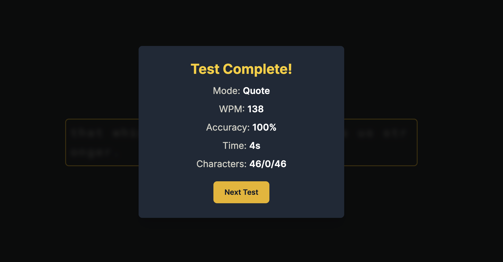

# TypeFaster ⌨️💨

TypeFaster is a web-based typing test application inspired by minimalist typing sites like Monkeytype. It helps users practice their typing speed and accuracy with a clean interface and dynamic feedback.


*(Not my best)*

## Features ✨

* **Multiple Test Modes:**
    * **Words:** Type a random selection of common words (configurable length: Short, Medium, Long).
    * **Quote:** Type a random famous quote.
* **Real-time Feedback:**
    * Instant WPM (Words Per Minute) calculation.
    * Live accuracy tracking.
    * Visual highlighting of correct and incorrect characters.
    * Smooth caret movement indicating the current position.
* **Dynamic Animations:**
    * Subtle "bump" animation for each typed letter.
    * Smooth transitions for UI elements (stats, results popup).
* **Clean & Minimalist UI:** Dark theme inspired by modern typing applications.
* **Responsive Design:** Adapts to different screen sizes.
* **Reset Functionality:** Easily restart the test or start a new one.
* **End-of-Test Results:** Detailed summary including WPM, accuracy, time, and character counts.

## Tech Stack 🛠️

* **HTML:** Structure of the web page.
* **CSS:** Styling, primarily using **Tailwind CSS** (via CDN). Includes custom animations and theme adjustments.
* **JavaScript:** Core logic for test generation, input handling, stats calculation, and DOM manipulation.
* **Lucide Icons:** For UI icons (via CDN).

## Setup & Installation 🚀

Since the project uses vanilla HTML, CSS, and JavaScript with CDN links for Tailwind and Lucide, setup is straightforward:

1.  **Clone the repository:**
    ```bash
    git clone <your-repository-url>
    cd TypeFaster
    ```
2.  **Ensure files are linked:** Make sure your `index.html` file correctly links to your `style.css` and `script.js` files:
    ```html
    <head>
        <link rel="stylesheet" href="style.css">
        </head>
    <body>
        <script src="script.js"></script>
    </body>
    ```
3.  **Open in Browser:** Simply open the `index.html` file in your web browser.

No build steps or dependencies are required beyond a modern web browser.

## How to Use 🖱️

1.  **Select a Mode:** Click on the mode buttons (Words, Short, Long, Quote) at the top to choose your preferred test type.
2.  **Start Typing:** Click on the text area or simply start typing. The timer begins with your first keystroke.
3.  **Type the Text:** Type the words displayed. Correct characters are shown normally, incorrect ones are highlighted. Use backspace to correct errors.
4.  **View Stats:** WPM and Accuracy are updated live in the stats section above the text.
5.  **Reset:** Click the refresh icon (<i data-lucide="refresh-cw"></i>) or use `Ctrl+Backspace` (or `Cmd+Backspace` on Mac) to reset the test at any time.
6.  **Results:** Upon successful completion, a popup displays your final score. Click "Next Test" to start again in the same mode.

## Contributing 🤝

Contributions are welcome! If you have suggestions for improvements or find bugs, please feel free to open an issue or submit a pull request.

## License 📄

This project is likely under the MIT License (or choose another license if you prefer). Add a `LICENSE` file to your repository.

